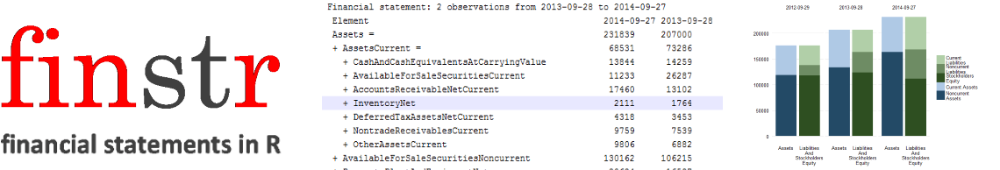

```{r, echo = FALSE}
knitr::opts_chunk$set(
  collapse = TRUE,
  comment = "#>",
  fig.path = "img/README-"
)
```



The purpose of **finstr** package is to create an environment for 
reproducible financial statement analysis. 
The package will not cover specific types of 
analysis (except in examples and package vignettes) but will provide
a domain language to write them. 
With other functions in basic R and existing R packages it anables users 
to store, share, reuse and reproduce the results of their analitic work.

For now it is offering:

**1. Data structure for financial statements**

  - Reading from data parsed with XBRL package
  - Statements in tidy format with accounting taxonomy concepts as columns
  - Encapsulates calculation hierarchy of variables
  - Default printing in transposed format and with visible hierarchy

**2. Statement calculation validation**

  - Calculation of higher order elements
  - Check if calculated values match original values
  
**3. Merge statements** 

  - Merge different periods of equal statement type
  - Merge statements of a different type 
  
**4. Calculate and reveal**

  - Custom financial ratio calculations definitions 
  - Exposing data by rearranging the statament hierarchy
  - Time lagged difference


## Install finstr
To install finstr from github use install_github from devtools package: 
```{r, eval=FALSE}
library(devtools)
install_github("bergant/finstr")
```

```{r, echo=FALSE, results='hide', message=FALSE }
library(dplyr)
library(tidyr)
library(finstr)
data(xbrl_data_aapl2013)
data(xbrl_data_aapl2014)
```


## Get data
Use XBRL package to parse XBRL files. For example:
```{r xbrl_parse_min, eval=FALSE, echo=TRUE}
library(XBRL)
# parse XBRL (Apple 10-K report)
xbrl_url2014 <- 
  "http://edgar.sec.gov/Archives/edgar/data/320193/000119312514383437/aapl-20140927.xml"
xbrl_url2013 <- 
  "http://edgar.sec.gov/Archives/edgar/data/320193/000119312513416534/aapl-20130928.xml"
old_o <- options(stringsAsFactors = FALSE)
xbrl_data_aapl2014 <- xbrlDoAll(xbrl_url2014)
xbrl_data_aapl2013 <- xbrlDoAll(xbrl_url2013)
options(old_o)
```

## Prepare statements
With `xbrl_get_statements` convert XBRL data to *statements* object. 
```{r xbrl_get_statements}
library(finstr)

st2013 <- xbrl_get_statements(xbrl_data_aapl2013)
st2014 <- xbrl_get_statements(xbrl_data_aapl2014)
st2014
```

Statements object is a list of 
several statement objects (ballance sheets, income and cash 
flow statements).

To get a single *statement* use *statements* object as a regular R list:
```{r statement}
balance_sheet2013 <- st2013$StatementOfFinancialPositionClassified
balance_sheet2014 <- st2014$StatementOfFinancialPositionClassified
income2013 <- st2013$StatementOfIncome
income2014 <- st2014$StatementOfIncome
balance_sheet2014
tail(income2014, 2)
```


## Validate statement calculation hierarchy
Recalculate higher order concepts from basic values and check for errors.

```{r check}
check <- check_statement(balance_sheet2014)
check
```

In case of error the numbers with errors will be presented along with elements:
```{r check_error}
check_statement(
  within(balance_sheet2014, InventoryNet <- InventoryNet * 2)
)
  
```


Validation returns all calculation results in a readable data frame.
Lets check only operating income from income statement:

```{r check_results check}
check <- check_statement(income2014, element_id = "OperatingIncomeLoss")
check
check$expression[1]
check$calculated / 10^6

```


## Merge statements from different periods
Use `merge` function to create single financial statement data from two 
statements. 
```{r merge_statement}
balance_sheet <- merge( balance_sheet2013, balance_sheet2014 )
```

The structure of merged balance sheets may differ if XBRL
taxonomy changes. 
Function `merge` takes care of it by expanding the elements 
hierarchy to fit both statements. 
The values of any missing elements in different periods is set to 0.

To merge all statements from *statements* object use merge on statements objects:
```{r merge_statements}
# merge all statements
st_all <- merge( st2013, st2014 )
# check if balance sheets are merged:
balance_sheet <- st_all$StatementOfFinancialPositionClassified
balance_sheet$endDate
```

## Merge different types of statements
If there are no matching elements between the two statements 
`merge` joins statements by matching their periods.
For some financial ratio calculations the combined statement may be  
a better starting point.

```{r merge_types, eval=FALSE}
  merge.statement(
    st_all$StatementOfFinancialPositionClassified, 
    st_all$StatementOfIncome )
```


## Calculate financial ratios
Statement object (in our case `balance_sheet`) is also a data frame object
with statement elements as columns and time periods as rows.
It is possible then to use statement as a data frame.

Lets calculate current ratio which is defined by

$$ Current Ratio = \frac{Current Assets}{Current Liabilities} $$

With dplyr package we can use `mutate`, `select` or `transmute` functions:

```{r dplyr}
library(dplyr)

balance_sheet %>% transmute(
  date = endDate, 
  CurrentRatio = AssetsCurrent / LiabilitiesCurrent
)

```

By using `finstr::calculate` function we can achieve the same result but
don't have to handle the date field and there is a rounding parameter. 
Lets calculate for example two ratios:

```{r calculate}

balance_sheet %>% calculate( digits = 2,
  
    Current_Ratio = AssetsCurrent / LiabilitiesCurrent,
    
    Quick_Ratio =  
      ( CashAndCashEquivalentsAtCarryingValue + 
          AvailableForSaleSecuritiesCurrent +
          AccountsReceivableNetCurrent
        ) / LiabilitiesCurrent
    
)
```


If we need a period average value we can use a `lag` function.
For example, to calculate *DSO* (days sales outstanding) over longer periods
the average of account receivable is compared to net sales.

We will use the formula for yearly preiods:

$$ DSO = \frac{Average Accounts Receivable}{Sales Revenue} \times 365 $$

In this case we need to connect two type of statements: balance sheets and
income statements. With matching reporting periods it can be accomplished 
with joining two data frames:

```{r DaysSalesOutstanding}

merge(balance_sheet, st_all$StatementOfIncome ) %>% calculate( digits = 2,
                                                               
    .AccountReceivableLast = lag(AccountsReceivableNetCurrent),
    .AccountReceivableAvg = (.AccountReceivableLast + AccountsReceivableNetCurrent)/2,
    
    DaysSalesOutstanding = .AccountReceivableAvg / SalesRevenueNet * 365 
  )

```

The leading dot instructs the calculate function to hide the value. In our case
only DaysSalesOutstanding is selected in final result. Use `digits` parameter to control rounding.

## Reusing calculations
When running same calculation for different statements, define the
calculation with `calculation` and call `calculate` with argument
`calculations`:

```{r calculation}
# define calculation
profit_margins <- calculation(
  
  Gross_Margin = 
    (SalesRevenueNet -  CostOfGoodsAndServicesSold) / SalesRevenueNet,
  
  Operating_Margin =
    OperatingIncomeLoss / SalesRevenueNet,
  
  Net_Margin = 
    NetIncomeLoss / SalesRevenueNet
  
)

# run profit margins for two different statements
income2013 %>% calculate(calculations = profit_margins, digits = 2)
income2014 %>% calculate(calculations = profit_margins, digits = 2)

```

## Rearranging statement hierarchy
Calculations gives us freedom to use any formula with any data from 
financial statements.
Most of the time this is not necessary as we can get useful information just by
regrouping calculation hierarchy.

There are many additional reasons why is rearranging statements useful step before
actual calculations:

   * We can avoid errors in formulas with many variables
   * Accounting taxonomies do change and using many formulas on original statement is
   harder to support than using custom hierarchy for analysis starting point
   * When sharing analysis it is much easier to print 6 values instead of 30
      
To rearrange the statement to simple 2-level hierarchy use `expose` function.

```{r expose}
expose( balance_sheet,
  
  # Assets
  `Current Assets` = "AssetsCurrent",
  `Noncurrent Assets` = other("Assets"),

  # Liabilites and equity
  `Current Liabilities` = "LiabilitiesCurrent",
  `Noncurrent Liabilities` = other(c("Liabilities", "CommitmentsAndContingencies")),
  `Stockholders Equity` = "StockholdersEquity"
)

```

Balance sheet stays divided by *Assets* and *Liabilities and Equity*.
For the second level we are exposing *current assets* from *noncurrent* and 
similar is done for the *liabilities*. We choose to separate *equity*.

Function `expose` expects a list of vectors with element names.
Function `other` helps us identify elements without enumerating every single element.
Using `other` reduces a lot of potential errors as the function "knows" which
elements are not specified and keeps the balance sheet complete.


Sometimes it is easier to define a complement than a list of elements.
In this case we can use the `%without%` operator. Lets expose for example
*tangible* and then *intangible* assets:

```{r expose_without}
expose( balance_sheet,
  
  # Assets
  `Tangible Assets` = 
    "Assets" %without% c("Goodwill", "IntangibleAssetsNetExcludingGoodwill"),
  `Intangible Assets` = other("Assets"),

  # Liabilites and equity
  `Liabilities` = c("Liabilities", "CommitmentsAndContingencies"),
  `Stockholders Equity` = "StockholdersEquity"
)

```

##Lagged difference
To calculate lagged difference for entire statement use `diff` function.
The result is statement of changes between successive years:

```{r diff}

diff(balance_sheet)

```


# Balance sheet visualization

## Prepare custom hierarchy
The only way to visualize a balance sheet is by exposing a limited number of values. 
The first step is then to aggregate a balance sheet by selected concepts.
We can use `expose` to specify these groups of elements. For example:

```{r expose_graph}
bs_simple <- expose( balance_sheet,
  
  # Assets
  `Current Assets` = "AssetsCurrent",
  `Noncurrent Assets` = other("Assets"),
  # Liabilites and equity
  `Current Liabilities` = "LiabilitiesCurrent",
  `Noncurrent Liabilities` = other(c("Liabilities", "CommitmentsAndContingencies")),
  `Stockholders Equity` = "StockholdersEquity"
)

```

## Print as a table
```{r htmlTable, warning=FALSE}
library(htmlTable)
print(bs_simple, html = TRUE, big.mark = ",", dateFormat = "%Y")
```


## Double stacked graph
Using ggplot2 package we can plot a simplified balance sheet:

```{r graph_byside, fig.width=7.0}
library(ggplot2)

plot_double_stacked_bar(bs_simple)

```

Another option is to group by faceting balance sheet side instead of date:

```{r graph_bydate, fig.width=7.0}

plot_double_stacked_bar(bs_simple, by_date = FALSE)

```

Using **proportional** form we reveal the changes in balance sheet structure:

```{r graph_prop, fig.width=7.0}

bs_simple_prop <- proportional(bs_simple)
plot_double_stacked_bar(bs_simple_prop)

```
